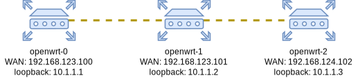

# dlan-example

Demo code for quickly bringing up some VMs to test out the dlan ansible module with a sample configuration. This repo is for demo only, do not use as a reference for a real world setup as there are some dangerous simplifications for the sake of convenience (e.g. ssh host key checking is disabled in the ansible config, wireguard keys are committed plaintext in the repo, etc).

Instructions:
1. Install the required dependencies:
    * Terraform 0.12+, and the [terraform libvirt provider](https://github.com/dmacvicar/terraform-provider-libvirt)
    * Ansible 2.9+, `curl`, `libguestfs-tools`, libvirt
    * You should have passwordless sudo access to command `virt-copy-in` (or, if your sudo installation supports credential caching, run `sudo -i true` before running terraform commands)
1. In the terraform dir, run `terraform init && terraform apply` to bring the instances up.
    * If needed, tune the network ranges if required, in the `network.tf` file.
    * This will also download and prepare OpenWrt's kernel and disk images.
    * Gotcha: you may need to re-run this if you need the VMs again after rebooting your machine, as the libvirt networks tend to forget the IP static leases.
1. Install the dlan module and configure the hosts. This is a multi-step process. While in the `ansible` dir:
    1. Populate the `dlan_authorized_keys` variable, in `group_vars/all.yml`, with your own ssh key.
    1. If you edited the network ranges in terraform, you should also do it in the `dlan_links` variables under`host_vars`, and in the inventory.
    1. Run `ansible-galaxy install -r requirements.yml` to download the dlan module
    1. Run `ansible-playbook -t bootstrap local.yml` to prepare the test instances for ansible execution
    1. Run `ansible-playbook -D local.yml` for actually configuring the instances

After doing the above, the virtual overlay network will look as follows:

Note that the testbed consists only of routers, there are no client hosts in the private networks. If you'd like to test that out as well (e.g. is the DHCP server of the routers working? Will dnsmasq correctly create a DNS entry for this host?), you can just manually spawn a VM in libvirt, and attach it to any router's private network.

After waiting a bit for OSPF to converge, you can verify that the following is possible:
* You can ping openwrt-2 from openwrt-0. Connect to openwrt-0 with `ssh -o StrictHostKeyChecking=no -o UserKnownHostsFile=/dev/null root@192.168.123.100` and then run `ping openwrt-2.lan`.
    - It's worth noting that the `openwrt-2.lan` loopkup is delegated to openwrt-2 itself, which gives back its loopback address `10.1.1.3`.
    - You can verify with tcpdump that these packets are indeed travelling through the VXLAN tunnels.
    - `echo "show ospf topology ospf4" | birdc` will show the topology of the network as learned by the bird daemon.
* From your host machine, curl the exposed services on each of the VMs' external IPs. E.g. `curl 192.168.123.100:8080`
    - As defined in the `dlan_proxy` variable, port 8080 exposes the nginx stub of the host you're making the request to. Port 8081 will round-robin through the nginx stub endpoints of all routers.
    - Also hostnames could have been used for port's 8081 config (e.g. `openwrt-0.lan` instead of `10.1.1.1`), but these names are not available on the first ansible run due to DNS delegation not being ready yet, and this prevents nginx from starting (it will try to resolve the names at launch time and fail). Also note that if you use the routers' hostname in the upstreams, each router will be proxied to twice in a row in each full round-robin iteration, as the hostnames return two IPs, one IPv4 and one IPv6.

If during your tests you run into any networking issue and can't access an instance anymore, you can just open a VM's virtual terminal an press enter, and a root shell will be available to check what's wrong. But starting from scratch is always an option, simply run `terraform destroy && terraform apply` from the terraform directory.
